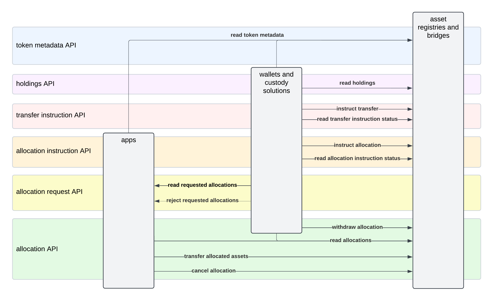

<pre>
  CIP:  CIP 0056
  Layer: Daml
  Title: Canton Network Token Standard
  Author:
    Simon Meier
    Matteo Limberto
    Moritz Kiefer
  License: CC0-1.0
  Status: Approved
  Type: Standards Track
  Created: 2025-03-07
  Approved: 2025-03-31
  Post-History: https://lists.sync.global/g/cip-discuss/topic/110627661#msg13
</pre>

## Abstract

Define standard APIs for Canton Network tokens so that wallets and apps can use
them and build on them in a uniform way.

## Specification

This CIP proposes standard APIs for Canton Network tokens so that wallets and
apps can use them and build on them in a uniform way, i.e., by working only
against the standard APIs without depending on the specifics of an individual
asset.

This CIP also proposes that Canton Coin implements all APIs and complies with the Canton Network token standard
except for [two limitations](#canton-coin-implementation) that are expected to be removed in the future.

In the remainder of this specification, we first provide an overview of the APIs and
the functionality they enable. We then provide technical details. A complete implementation
proposal is available [here](#implementation-proposal).

### Overview

This standard is concerned with three kinds of applications:

- **asset registries**:
  which are used to manage the ownership records of tokenized assets.
  For example, Amulet as the app backing Canton Coin, or Brale using
  the Digital Asset tokenization utility app to issue SBC on Canton.

- **wallets and custody solutions**:
  which are used by investors to manage their holdings of tokenized assets
  across multiple asset registries. For example, DFNS, Copper, or future
  retail oriented wallets.

- **apps**: any other services which interact with tokenized assets on-chain.

The standard enables building wallets that provide the following functionality to investors:

1. **Portfolio view**:
   Display current and past holdings as well as transaction history for all their asset holdings
   together with the total supply of the assets as reported by their registries.
2. **Direct Peer-to-Peer / Free of Payment (FOP) Transfers**:
   Initiate direct peer-to-peer transfers of their holdings and monitor their progress.
   Note that these kind of transfers are also known as free of payment (FOP) transfers in TradFi.
3. **Delivery versus Payment (DVP) Transfers**:
   Review, approve, and reject asset transfers requested by apps to atomically settle on-ledger DVP obligations.

The support for DVP transfers enables building apps that coordinate asset
transfers as part of their workflows: e.g., collateral management, OTC trading,
(decentralized) exchanges, or apps that accept Canton Network tokens as a means
of payment.

The workflows are designed with the needs of tokenized real world assets in mind.
For this purpose they support:

- **privacy**: information about asset holdings and transfers is shared on a need-to-know basis
- **control**: registries have full control over the structure of the workflows governing asset holdings and transfers

In the following, we explain the two transfer workflows and the portfolio view in more detail.

#### Direct Peer-to-Peer / Free of Payment (FOP) Transfer Workflow

The FOP transfer workflow supported by the standard enables an investor to send a
specific amount of their asset holdings to another investor, who is
the recipient of the transfer.

The transfer is always initiated by the sender using their wallet to submit a
Daml transaction that instructs the registry to execute the
transfer within a given deadline. Depending on the registry, the instruction
gets settled immediately as part of this one Daml transaction; or once
further registry-specific steps have happened as part of additional Daml transactions.

The latter option is provided for registries that require additional approvals
to be collected before a transfer can be executed; or registries whose authoritative
ledger is maintained outside of Canton. Registries are allowed to abort a
transfer instruction in case the transfer cannot be executed.

#### Delivery versus Payment (DVP) Transfer Workflows

The DVP transfer workflows enable multiple asset transfers to be executed as
part of a single Daml transaction in an all-or-nothing fashion: either all
transfers settle or none of them does.

For this purpose, the registries allow investors to use their wallet to allocate
some of their asset holdings to a settlement request for a fixed amount of time. Once
all allocations required for a settlement are present, the app executing the settlement
submits the one Daml transaction that triggers all of the transfers.

More concretely, the standard specifies APIs that enable an app, called the
settlement app in the remainder of the section, and wallets to support
workflows along the following lines:

1. The user uses the settlement app to get to a point where they are required to deliver
   some of their assets as part of a settlement. For example, they made a
   matched bid on an exchange app or they requested to purchase a good in
   exchange for some of their asset holdings.
2. The user sees the requested asset allocation for that settlement in their wallet
   and uses the wallet to create the Daml transaction that instructs the registry
   to create a corresponding allocation.
3. The settlement app  observes the creation of the allocation on its validator node.
   It checks whether all allocations for the settlement have been created and, if yes,
   it submits the transaction that completes the settlement, which includes the
   execution of all transfers of the allocated assets.

All settlements specify a deadline, and allocations are only valid until that deadline.
Thus the asset holdings are only locked to an allocation until that deadline, and
become available again to their owner immediately thereafter.

It is up to the apps to decide how to deal with settlements that fail to complete within
their deadline. They may just retry them, or they may also implement punitive actions
for the trading parties that failed to allocate their assets within time.

Analogously to transfer instructions, asset registries are allowed to use multi-step
workflows to process an allocation instruction into an actual allocation. They can
use that for example to check internal risk systems or to earmark the allocated funds
in an authoritative ledger maintained outside of Canton.

#### Wallet Client / Portfolio View

As one can see from the description of the transfer workflows above, a user's wallet serves a central role in
these workflows. The user is expected to configure their wallet client
such that it can get real-time access to their asset holdings and in-progress
transfers using the Ledger API of a validator node hosting the user's Daml parties.
The wallet client can use this access to populate a portfolio view of all of the
user's assets and the in-progress workflows on them.

The wallet client can also use that Ledger API access to prepare Daml transactions
that match a user's desired action: e.g., creating a FOP transfer instruction.
It is the user's choice whether they setup their party to use
[external signing](https://docs.digitalasset-staging.com/canton/3.3/tutorials/external_signing_submission.html)
or whether they delegate the signing to their validator node.
Registries should aim to allow for up to 24 hours between the preparation of
such a transaction and their submission to the network. This is to allow for
external signing workflows that require human intervention.

##### Registry Specific UIs

The standard allows registries to communicate the URL for a registry-specific
UI to wallet clients. Redirecting the user to this URL serves as an escape hatch
for serving registry specific data and driving registry-specific workflows.

The URL for the registry-specific UI could for example be used for the user
to ask for the redemption of a wrapped token to a specific address on the
original chain/ledger. Providing this URL allows universal wallet clients
to handle all steps of common workflows, while allowing registries to
implement custom workflows where required.

Furthermore, registries that do not use Canton as the authoritative ledger
might decide to not represent holdings on Canton. This is still valuable,
as these assets can be used in DVP workflows like any other asset.
The generic wallet clients would show real-time information about all in-progress transfers.
Instead of showing the holdings they would though show a redirect to the registries
own UI for querying the holding balance.

The standard does not define an interface to query the holdings of such registries
from a Canton wallet client, as that would require standardizing how to authenticate
such a call.

#### Canton Coin Implementation

Canton Coin (CC) implements all APIs of the standard.
FOP transfers of CC require receivers to have preapproved incoming transfers from any sender.
They are completed as part of the single Daml transaction instructing them.
Likewise, DVP allocations of CC are created within a single Daml transaction instructing them.
No preapproval by the receiver is required, as that authorization is expected to
be funneled through the apps' settlement worklows.

CC is standards compliant except for the following two limitations:

- *short submission delay*: the CC implementation only supports a 1 minute
  delay between preparing a transaction and submitting it to the network.
  This is in contrast to the 24h delay targeted by the standard.
- *no holding fees in portfolio view*: the amounts of CC holdings always show
  the amount as of the round that they were created in. Wallets cannot
  use the standardized APIs to display holding fees for CC holdings, but they
  can read the `Amulet` contracts themselves if they desire to show holding fees.

Both of these limitations are expected to be removed in the future, as
explained in [Canton Coin Limitations](#canton-coin-limitations).

### Details

The standard defines six APIs. Each consists of an on-ledger Daml API and
optionally an off-ledger HTTP API. The six APIs and their purpose are:

- *token metadata API*: serve symbol name, total supply, URL for registry-specific UI, other metadata
- *holdings API*: populate portfolio view and transaction history
- *transfer instruction API*: initiate and monitor FOP transfers
- *allocation API*: allocate assets to execute DVP transfers
- *allocation request API*: uniform way for apps to request allocations
- *allocation instruction API*: uniform way for wallets to create allocations

A draft PR with all Daml and OpenAPI definitions for all six APIs is linked
below in the [Implementation Proposal](#implementation-proposal) section. Daml
APIs are specified using Daml interfaces and HTTP APIs are specified using
OpenAPI.

The following diagram provides an overview of the interactions enabled by these
APIs. Arrows point from the API client to the API implementor.

#### Implementation Requirements

The code in the [Implementation Proposal](#implementation-proposal) provides
the exact definitions of the APIs together with inline comments specifying the
exact contracts between API clients and implementors.

Asset registries can in principle freely choose which of the five APIs
concerning them they want to implement. However, they should implement all five
of them to maximize the utility of their tokens. The exception are asset
registries whose authoritative holding records are not maintained on Canton.
They may decide to not implement the "holdings API" to avoid stale holding
records on Canton.

Wallets and custody solutions should aim to make use of all six APIs to provide
a uniform UX across all Canton Network tokens. They should query a registry's
metadata to figure out which APIs it supports and adjust their UI accordingly.

Apps may use the "allocation API" to orchestrate asset transfers as part of
their own workflows. They may also implement the "allocation request API"
to integrate with wallets in a uniform way.

##### Global Synchronizer Connectivity for Settlement Workflows

This CIP recommends registries to maximize the utility of their assets by
connecting to the Global Synchronizer and supporting the execution of
settlement workflows with their assets on the Global Synchronizer.  This is only a
recommendation. They are free to use the token standard APIs on private
synchronizers as they see fit.

The reason for this recommendation is that the input contracts (i.e., UTXOs) referenced by a Daml transaction
must all be assigned to the same synchronizer.
Settlement transactions likely involve multiple registries, holders, and apps.
Therefore the most likely synchronizer that all input contracts of a settlement transaction
can be assigned to is the Global Synchronizer.
Thus the benefit of connecting to the Global Synchronizer for settlement workflows is that this
maximizes the chance of there being a synchronizer that can synchronize
the Daml transactions required for the settlement to complete.

#### UTXO Access Management

Note that Canton manages the state of its ledger using an extended Unspent-Transaction-Output (UTXO) model
(see [Polyglot Canton whitepaper](https://www.canton.network/hubfs/Canton%20Network%20Files/whitepapers/Polyglot_Canton_Whitepaper_11_02_25.pdf)).
There is a one-to-one correspondence between Daml contracts and UTXOs.
Canton's UTXOs are annotated with their stakeholders and are only distributed to the nodes hosting these stakeholders.

Constructing transactions requires access to all UTXOs referenced or consumed by the transaction.
ledger API clients can retrieve UTXOs known to their parties from their validator node and
the UTXOs known to an app provider using off-ledger API calls to app-specific services.

The standard proposes to provide UTXO access for constructing transactions involving tokens as follows:

- **wallet access to user parties**:
  wallets are assumed to have access to the Ledger API of the validator node hosting the parties of their users
  and use that to retrieve all UTXOs known to these parties.
- **registry off-ledger APIs**:
  registries serve UTXOs private to the registry via standardized HTTP APIs specified using OpenAPI as part of the standard.

#### Off-Ledger API Discovery and Access

As explained in the previous section, the standard expects registry apps to
expose the standard's HTTP endpoints for accessing UTXOs. It further expects
these endpoints to be exposed to the public internet under a common URL prefix
to provide maximal freedom for wallets and apps to fetch these.

The standard does not require requests to these HTTP endpoints be authenticated, as all of them
either access data that is expected to be public (e.g., registry metadata) or
data that is protected by a difficult to guess identifier (e.g., the contract-id
of an allocation). See [this section](#no-authentication-on-registry-off-ledger-apis)
for the rationale.

Decentralized registries (like Amulet) should serve these HTTP endpoints from each of their nodes
using one URL prefix per node.
Apps and wallets are free to choose any of the HTTP endpoints to query.
The registry's Daml code must be written such that none of the nodes can influence the integrity
of the Daml transactions built using the data from the node's HTTP response.
Apps and wallets can thus get Byzantine-Fault-Tolerance by querying the
off-ledger data from a random URL prefix of the decentralized registry and
retrying in case the transaction submission fails.

Apps and wallet clients can discover a (decentralized) registry's URL prefixes
by [querying the metadata](#cns-entry-metadata) of the CNS entry for the registry's
`admin` party with the key `splice.lfdecentralizedtrust.org/registryUrls`, and
parsing it as a comma-separated list of URLs.

#### Generic Metadata

The standard employs generic metadata records to enable transporting additional data as
part of the standardized workflows. These metadata records are text-based
key-value maps. Concretely, they are present on

- choice arguments: for the caller to provide extra context information,
  e.g., the reason for withdrawing an allocation
- choice results: for the implementation to provide extra information about choice execution,
  e.g., the fees charged
- interface views: for the implementation to provide extra information about the contract,
  e.g., an associated account-id
- data records: to associate extra information throughout workflow with that data record
  e.g., an off-ledger correlation id for the trade that is being settled

App implementors, standard proposals, and standards are free to define metadata
keys provided they prefix them with a DNS subdomain that uniquely identifies the
organization defining the key, thereby avoiding clashes between keys from
different organizations.

This approach follows the design of
[Kubernetes Annotations](https://kubernetes.io/docs/concepts/overview/working-with-objects/annotations/)
and enables new metadata keys to be introduced both in a top-down fashion by
defining their meaning as part of CIPs, as well as in a bottom-up fashion by
keys being defined ad-hoc and adopted more widely purely based on their
usefulness.

The metadata keys defined by this CIP are defined as part of
[splice](https://github.com/hyperledger-labs/splice) and thus prefixed with
`splice.lfdecentralizedtrust.org/`. Concretely, this CIP introduces the following two
metadata keys:

- `splice.lfdecentralizedtrust.org/registry-urls`: a comma-separated list of URLs of
  the off-ledger APIs of a registry, used to [discover the off-ledger APIs of registries](#off-ledger-api-discovery-and-access)
- `splice.lfdecentralizedtrust.org/lock-context`: used on `Holding` contracts to
  provide a human-readable description of the context for the lock on a holding
- `splice.lfdecentralizedtrust.org/reason`: used to communicate a human-readable
  reason for calling a choice. Registries, apps, and wallets should use this to
  provide a reason when calling choices that advance a workflow differently
  from the default path (e.g., withdrawing an allocation or aborting a transfer
  instruction).

##### Metadata Key Syntax

Metadata keys follow the same format as [Kubernetes Annotations](https://kubernetes.io/docs/concepts/overview/working-with-objects/annotations/),
and have two segments: an
optional prefix and name, separated by a slash (`/`). The name segment is required
and must be 63 characters or less, beginning and ending with an alphanumeric
character (`[a-z0-9A-Z]`) with dashes (`-`), underscores (`_`), dots (`.`), and
alphanumerics between. The prefix is optional. If specified, the prefix must be
a DNS subdomain: a series of DNS labels separated by dots (`.`), not longer than
253 characters in total, followed by a slash (`/`).

##### Storing Generic Metadata in CNS 1.0 Entries

At the time of writing, entries in the
[Canton Name Service 1.0 (CNS)](https://docs.dev.sync.global/app_dev/scan_api/scan_aggregates_api.html#looking-up-ans-entries)
do not have native support for metadata, but they do offer a free-text `description` field.

This CIP thus proposes to treat this description field as a JSON object and
store the metadata entries as a record in a field named `meta`. The
metadata entries associated with the `admin` party can thus be retrieved by:

1. Querying any Scan URL of an SV node for the CNS entry of `/v0/ans-entries/by-party/<admin-party-id>`
2. Parsing the JSON object in the `description` field of the response as a record.
3. Accessing the `meta` field of that record to get the metadata entries.

If any of the steps fail, then there is no metadata associated with the `admin` party.

Note that [`/v0/ans-entries/by-party/`](https://docs.dev.sync.global/app_dev/scan_api/scan_openapi.html#get--v0-ans-entries-by-party-party)
returns the CNS entry for the party with the lexicographically smallest name.
Registry operators must make sure to store their metadata on that entry for the above procedure to work.
The easiest way to do so is to allocate at most one CNS entry for their `admin` party.

#### Additional Portfolio View Concerns

##### Transaction History

The standard aims to enable wallet clients to serve a transaction history view to their users that explains
all changes to a users' portfolio view and their view of in-progress transfers.

The standard APIs thus define choices for common actions taken by registries,
wallets, or apps on user-visible contracts that implement one of the standard's
Daml interfaces.  Thereby enabling wallets to parse the transaction history in
an implementation-agnostic way using an interface filter to subscribe to the
transaction tree stream served on the Ledger API of the validator node hosting
the user's Daml parties.

Wallet clients should implement a fallback mechanism to display changes to the
user-visible contracts via registry-specific choices that are not part of the
standard. For example, they could show the JSON rendering of the choice name and
argument together with the archival and creation of the affected contracts; and offer an
option to the user to inspect the full sub-transaction below the choice.

##### Total Supply

Registries may optionally report the total supply of a tokenized asset on the off-ledger token metadata API.
If they decide to do so, then that total supply should be computed by summing up the `amount` field of
all active  `Holding` contracts with a matching `instrumentId`.

## Motivation

As Hashnote, Brale, SocGen and others have begun to tokenize assets on the Global
Synchronizer, and Copper and Dfns have added secure wallet support for Canton
Coin, we have reached an ecosystem scale that needs standards that will make all
Canton Network tokens compatible and exchangeable. All Canton Network participants
benefit if it is easy for any Canton Network app or wallet to display and
interact with any asset tokenized on Canton.

## Rationale

### Relation to ERC20

This standard is inspired by the [ERC20 standard](https://eips.ethereum.org/EIPS/eip-20),
and covers all features of ERC20 except unconstrained allowances. More precisely:

- token metadata API: covers the ERC20 functions `name()`, `symbol()`, `decimals()`, `totalSupply()`
  - The `decimals()` call is covered implicitly: it can be assumed to always return the constant `10`,
    as all standard tokens represent amounts using the `Decimal` type of
    Daml, which are 38-digit fixed-point decimals with 28 digits before
    and 10 digits after the decimal point. We made the choice to use `Decimal` for
    all tokens to reduce the likelihood of conversion errors in apps, wallets,
    or registries.
- holdings API: covers the functions `balanceOf(...)` via
  on-ledger read from validator node hosting the investors parties
- transfer instruction API: covers the function `transfer(...)` for transactions doing a single transfer
- allocation APIs: cover the the atomic execution of multiple `transfer(..)` function calls in the same
  transaction. They thus provide fine-grained control over `approve(...)` and `allowance(...)` for settlement.
- interface filters
  ([proto](https://github.com/digital-asset/canton/blob/b7bad9cce18ae9184ee67d7acb3237589e5bccec/community/ledger-api/src/main/protobuf/com/daml/ledger/api/v2/transaction_filter.proto#L58-L76))
  on the Ledger API for the choices from these APIs cover the ERC20 `Transfer`
  and `Approval` events via the transaction trees stream
  ([proto](https://github.com/digital-asset/canton/blob/b7bad9cce18ae9184ee67d7acb3237589e5bccec/community/ledger-api/src/main/protobuf/com/daml/ledger/api/v2/update_service.proto#L38-L42))
  on validator nodes

This CIP does no standardize an allowance API for two reasons:

1. We expect allocations to cover the majority of use-cases for allowance.
2. Allowances as structured in ERC20 do not work well with a UTXO model and privacy:
   the third-party holding the allowance is neither privy to the UTXOs that they
   could spend nor would they know which ones they can use without causing undue
   contention with concurrent activity by the owner or other parties with an
   allowance.

The design of a UTXO-compatible allowance API is left to a future CIP.

### Alternatives Considered

#### Shipping UTXOs On-Ledger

As explained in [UTXO Access Management](#utxo-access-management) the standard expects registries
to serve HTTP APIs that provide access to the UTXO's (i.e., Daml contracts)
required to call choices on the standard's Daml interfaces.
In contrast, public chains ship all required UTXOs on-ledger.
They also do not require any access management for reading data, which they can
get away with as they make all data public.

Explicitly managing that access is a hard requirement for any ledger with privacy.
However, one might wonder why we don't ship the data on-ledger for the sake of simplicity.
We propose to not do so and ship this data via off-ledger via HTTP APIs for the following reasons:

- *network scalability*: all transaction commits must go through a synchronizer, which
  is thus prone to become a bottleneck. Shipping data on-ledger would imply shipping them via
  a synchronizer that all relevant participants are connected to, which would increase the chance
  of it becoming a bottleneck.
- *traffic costs*: On the Global Synchronizer, transactions incur traffic costs. Distributing data off-ledger means instead of paying traffic costs on the Global Synchronizer you only pay for network egress costs for an HTTP API which is usually significantly cheaper.
- *hide implementation details*: what UTXO's to fetch for exercising an
  interface choice depends on the implementation of that choice. That implementation will likely
  change over time as part of the registry changing their workflows to address new business needs.
  Shipping just the data on-ledger to clients would thus not be enough. One
  would also need to ship the logic for retrieving the data on-ledger, which is challenging, in particular with respect to upgrades. Serving an HTTP endpoint from a
  registry operated server avoids this complication.
- *use standard technology*:
  HTTP API are a proven and very widespread technology for providing read-access to data, and
  thus carry low technological risk.
  Shipping private data on-ledger to provide read-access would be a new innovation with
  significantly higher technological risk.

#### On-Ledger Reporting of Total Supply

Reporting the total supply of tokenized asset off-ledger is done for the similar reasons as shipping UTXOs off-ledger:
scalability, traffic costs, and hiding implementation details.
Moreover, in contrast to public chains, shipping the total supply information on-ledger does not allow
indepenent verification of the total supply, as the holdings from which it is computed are private.

Note that this does not weaken the security, as the registries are already trusted to
maintain the private holding records and can thus also be trusted to report the
total supply correctly.

#### Canton Coin Limitations

As explained in [Canton Coin Implementation](#canton-coin-implementation),
the CC implementation of this CIP will come with two limitations:
a shorter submission delay and no generic support for wallets
to display holding fees.

There are two reasons for the shorter submission delay:

1. The `AmuletRules_Transfer` choice calls `getTime` to check that the
   round is open for recording transfers. These calls require the prepared
   transaction to pin the ledger time (see [Canton Time
   Model Docs](https://docs.daml.com/concepts/time.html)), which in turn limits the
   maximal record time up to which the transaction can be sequenced on the
   Global Synchronizer. The maximal skew between ledger time and record time
   allowed on the Global Synchronizer is 1 minute.
2. The `OpenMiningRound` contracts referenced in the `AmuletRules_Transfer`
   choice have a maximal life-time of 20 minutes, as that is the duration
   for which a round stays open for recording activity before it moves into
   the issuing phase. Thus any transaction referencing them becomes stale after
   20 minutes, as it refers to an archived contract (i.e., a spent UTXO).

The solution to both of these limitations is to restructure the activity recording
and CC issuance such that no round contracts are required at all. This can
be done by summarizing activity records for 10 minute intervals of ledger effective time
that are far enough in the past so that no new activity records can be created
within that interval.

Getting rid of round contracts also requires moving away from the round-based
holding fees that are currently charged. We expect to replace holding fees with
a time-based expiry of coin contracts that depends on their amount: for example at
an expiry rate of $1 per year, a coin contract worth $100 could be archived
by any SV after 100 years. This solves for the problem of SVs not having to
store dust-coins forever without the complication of time-dependent holding balances.

The CIP accepts the current CC limitations, as these two changes are non-trivial
pieces of work that we we didn't want to put on the critical path of
establishing a Canton Network token standard.

Furthermore, existing wallets already do have direct integrations with
[CC-specific FOP
workflows](https://docs.dev.sync.global/app_dev/validator_api/index.html#external-custody-api)
that allow for a 24h submission delay.

#### No Authentication on Registry Off-Ledger APIs

We believe that most tokenization use-cases can be implemented securely with
the protections in place in the current standard. The main protection being that
sensitive data like an investors holdings and in-progress transfers can only be
queried from the investors validator node. The secondary protection being that
accessing sensitive data via the off-ledger registry API requires knowing
corresponding contract-ids, which are unguessable for third-parties.

This CIP thus does not standardize an authentication scheme for the off-ledger APIs
of registries to accelerate the delivery of the first version of the Canton
Network token standard. We expect that an authentication scheme can and will be
standardized once there is sufficient demand for it.

#### Native Support for CNS Entry Metadata

The workaround of storing metadata in the description field of CNS entries is
a pragmatic solution to the lack of native support for metadata in CNS entries.
We did not aim to solve this limitation in this CIP for the sake of expediency.
We expect a future CIP to address that limitation by adding native support for
metadata to CNS entries.

## Backwards compatibility

The changes in this CIP are fully backwards compatible.

Existing apps can support the APIs by adding corresponding interface
implementations to their templates as part of a smart-contract upgrade.
Analogously to how the Amulet implementation was changed to support the APIs.

## Implementation proposal

A proposal for the implementation of the Daml interfaces and the OpenAPI specifications
can be found in the `token-standard/` directory in the `splice` repository on
the [`canton-3.3` branch](https://github.com/hyperledger-labs/splice/tree/canton-3.3/token-standard#readme).
The same branch also contains the `Amulet` implementation of the token standard
APIs and a Daml script test harness for apps building on the token standard and
for registries implementing the standard.

## Copyright

This CIP is licensed under CC0-1.0: [Creative Commons CC0 1.0 Universal](https://creativecommons.org/publicdomain/zero/1.0/)

## Changelog

2025-03-18 - Initial Draft
